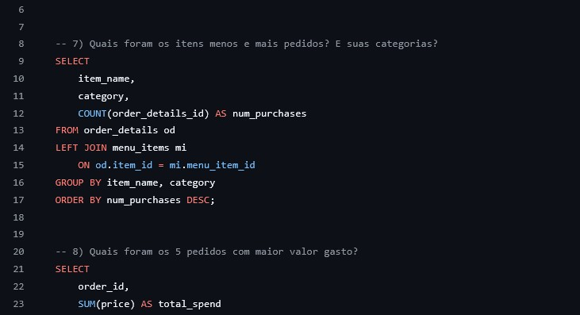

# Análise de Pedidos de Restaurante - Análise Exploratória (SQL)
Este projeto realiza uma Análise Exploratória de Dados (EDA) utilizando SQL para investigar o comportamento de pedidos em um restaurante.

O objetivo é extrair insights estratégicos a partir das tabelas `order_details` e `menu_items`.

---

---

## O projeto utiliza duas tabelas principais:

- **order_details** → Informações sobre pedidos realizados
- **menu_items** → Informações sobre os itens do cardápio (nome, categoria, preço)

---

## Tecnologias Utilizadas:

- SQL
- MySQL
- JOINs
- CTE (Common Table Expressions)
- Funções de agregação (`COUNT`, `SUM`, `MIN`, `MAX`)

---

## Análises Realizadas:

### 📅 Análise Temporal
- Intervalo de datas dos pedidos
- Total de pedidos realizados
- Total de itens vendidos

### 🛒 Análise de Volume
- Pedidos com maior quantidade de itens
- Quantidade de pedidos com mais de 12 itens

### 📦 Análise de Produtos
- Itens mais e menos pedidos
- Categorias mais vendidas

### 💰 Análise de Receita
- Top 5 pedidos com maior valor gasto
- Detalhamento do pedido com maior ticket médio
- Distribuição de categorias dentro do pedido mais caro

---

## Principais Insights:

- Identificação dos itens mais populares
- Identificação de pedidos com alto volume
- Análise de comportamento de consumo
- Identificação de categorias mais lucrativas
- Avaliação do ticket médio por pedido

---

## Objetivo do Projeto:

Demonstrar habilidades em:

- Manipulação e consulta de dados com SQL
- Uso de JOIN, aplicação de funções
- Construção de análises exploratórias
- Extração de insights estratégicos

---

Gabriel França da Silva  
Estudante de Análise de Dados  

